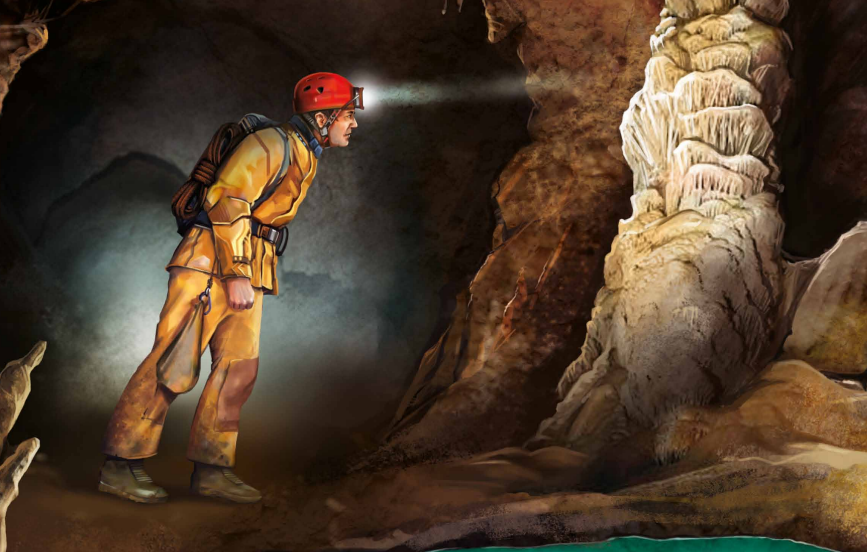

# Cave - Operational Research

## About project

The goal of the project was to solve a selected problem using an evolutionary or population-based algorithm. We chose an optimization problem based on a slightly modified simulation of the game "Cave." In this game, the player's objective is to earn points by exploring the cave, collecting treasures, and avoiding obstacles. We defined the cost function as the number of points the player earned.

To solve the problem, we chose the Bees Algorithm (BA), as it seemed most suitable for this problem. The Bees Algorithm is inspired by the natural behavior of bees during food foraging, making it particularly effective in optimizing combinatorial and continuous problems like ours.

## Authors

- [Dominik Jeżów](https://github.com/c-i-a-s-t-e-k)
- [Jakub Pawlina](https://github.com/jakubpawlina)
- [Iwo Szczepaniak](https://github.com/IwoSzczepaniak)
- [Adam Woźny](https://github.com/jakadam2)